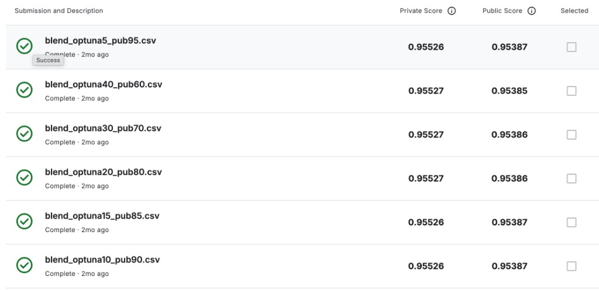
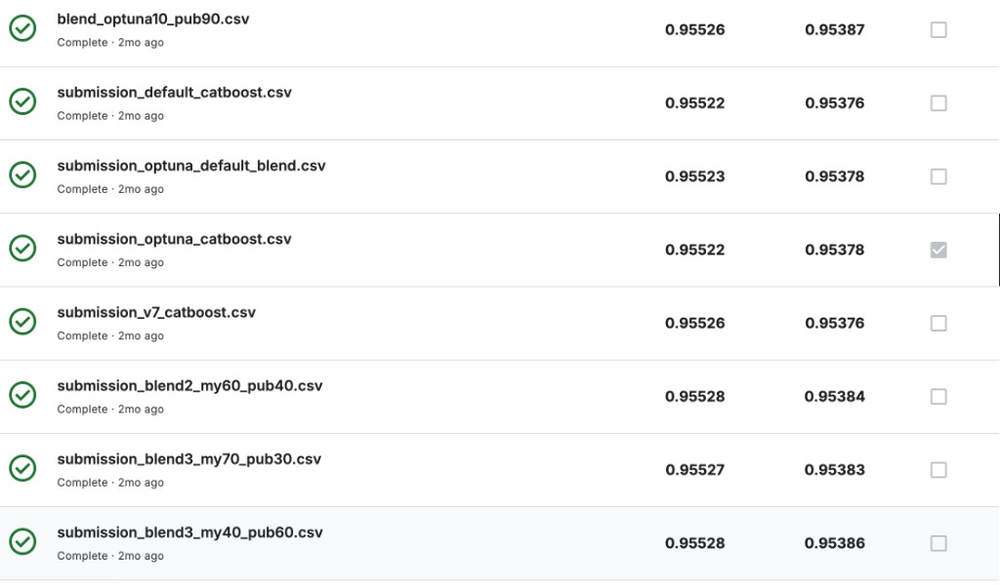

# Heart Disease Prediction（Kaggle形式）

患者の臨床データをもとに、心疾患の有無を予測する二値分類タスクです。  
単一モデルだけでなく、複数の提出結果をブレンドし、Public/Privateともに高いスコアを安定化させることを目的に改善しました。

## プロジェクト概要

- 目的: 二値分類精度の最大化
- データ: `data/raw/train.csv`, `data/raw/test.csv`
- 主な手法:
  - CatBoost を中心とした学習
  - Optuna によるハイパーパラメータ最適化
  - 複数提出の重み付きブレンド

## 改善プロセス

1. ベースライン作成（単一モデル）
2. 特徴量の拡張と検証
3. Optunaで探索し、モデル性能を改善
4. 複数提出を重み付きでブレンドして最終スコアを最適化

## 主な結果（提出比較）

| ファイル名 | Private Score | Public Score |
| --- | ---: | ---: |
| `blend_optuna5_pub95.csv` | 0.95526 | 0.95387 |
| `blend_optuna40_pub60.csv` | 0.95527 | 0.95385 |
| `blend_optuna30_pub70.csv` | 0.95527 | 0.95386 |
| `blend_optuna20_pub80.csv` | 0.95527 | 0.95386 |
| `submission_blend2_my60_pub40.csv` | 0.95528 | 0.95384 |
| `submission_blend3_my40_pub60.csv` | 0.95528 | 0.95386 |

`0.9552x`（Private）/ `0.9538x`（Public）を複数パターンで再現できており、  
単発ではなく、ブレンド設計による安定化を確認できました。

## 成果物

- Notebook（実験ログ）
  - `notebooks/03_feature/heart_disease_v6_features.ipynb`
  - `notebooks/04_tuning/heart_disease_v8_pseudo_label.ipynb`
  - `notebooks/04_tuning/heart_disease_multiseed_v3.ipynb`
- 提出ファイル
  - `outputs/submissions/submission_optuna_catboost.csv`
  - `outputs/submissions/submission_blend2_my60_pub40.csv`
  - `outputs/submissions/submission_blend3_my40_pub60.csv`
  - `outputs/submissions/archive/blend_optuna*.csv`
- 補助ユーティリティ
  - `src/utils/utils.py`

## スコア画面

## この案件で示せるスキル

- 試行回数を増やすだけでなく、仮説ベースで特徴量と学習条件を更新する力
- モデル単体とアンサンブルの役割を分けて設計する力
- リーダーボードの値だけでなく、再現性と安定性で判断する姿勢
